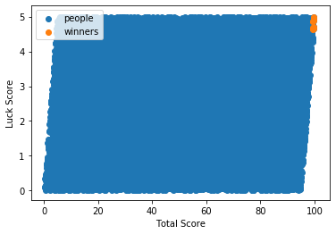
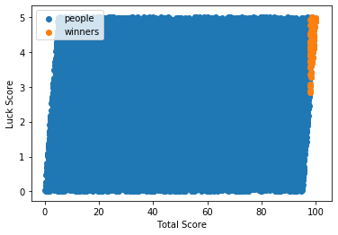
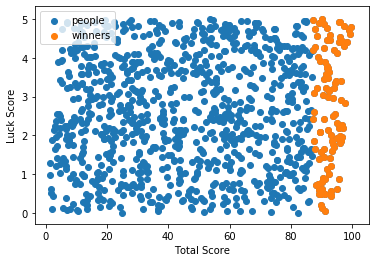
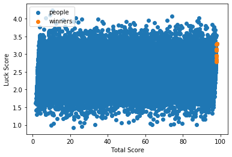
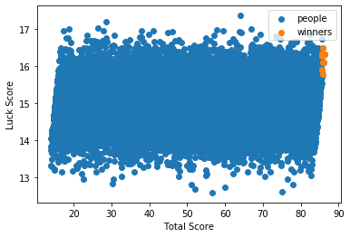
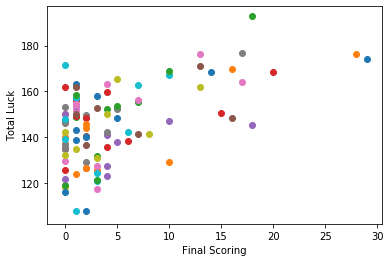
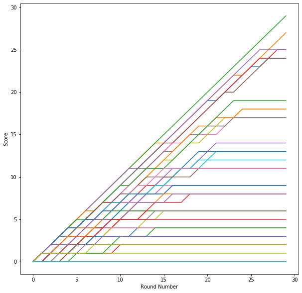
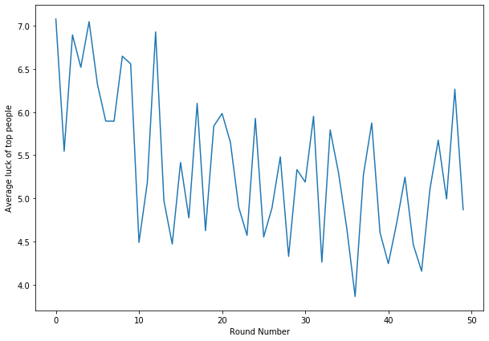

# Skill Vs Talent
Inspired by this video my veritasium [here](https://www.youtube.com/watch?v=3LopI4YeC4I&t=620s)

## Experiment 1, fixed level of talent
- Close aproximation to what was described in the video


```python
from random import random
import matplotlib.pyplot as plot
import math
```


```python
# Create a collection of people with skill and luck and randomly select the top % of them
def fixed_luck ( skill, applicants ) :
    people = [ { 
        'skill' : random() * skill,
        'luck' : random() * ( 100 - skill )    
    } for _ in range ( applicants ) ]
    return people
```


```python
def runSimulation ( skill = 95, winners = 10, applicants = 20000 ):
    people = fixed_luck ( skill, applicants)
    w_peop = sorted( people, key = lambda x : x['luck'] + x['skill'] )[-winners:]
    
    luck_rank =  round(sum([ _['luck'] for _ in w_peop]) / winners ,2)
    skill_rank =  round(sum([ _['skill'] for _ in w_peop]) / winners ,2)
    
    def scatter( people, l ):
        luck = [ p['luck'] for p in people ]
        total = [ p['luck'] + p['skill'] for p in people ]
        plot.scatter( total, luck, label = l)
        plot.xlabel('Total Score')
        plot.ylabel('Luck Score')
        
    scatter ( people, 'people' )
    scatter ( w_peop, 'winners' )
    
    print( f'Average winner has luck of {luck_rank}/{100-skill} and skill of {skill_rank}/{skill}')
    
    plot.legend()  
```


```python
runSimulation( skill = 95, winners = 10, applicants = 20000 )
print('Chart shows 20000 people with random lucks and skills and selecting the top 10 people from the collective.')
print('Because of the size of the numbers the people at the top must natualy have nearly max skill and luck')
```

    Average winner has luck of 4.81/5 and skill of 94.77/95
    Chart shows 20000 people with random lucks and skills and selecting the top 10 people from the collective.
    Because of the size of the numbers the people at the top must natualy have nearly max skill and luck
    





```python
# Same simulation but 100 winners, 10x the previous amount
runSimulation( skill = 95, winners = 100, applicants = 20000 )
print('With more winners available, the required luck falls sharply. People with average luck are now able to get in with high skill')
```

    Average winner has luck of 4.23/5 and skill of 94.25/95
    





```python
runSimulation( skill = 95, winners = 100, applicants = 1000 )
print('Dropping the requirements to accepting 1 out of 10 applicants, there is virtually no god-teir luck required at all. Pure skill. ')
```

    Average winner has luck of 2.71/5 and skill of 89.75/95
    Dropping the requirements to accepting 1 out of 10 applicants, there is virtually no god-teir luck required at all. Pure skill. 
    





## Experiment 2, variable level of talent
- In reality luck isnt just assigned to you once, its a continous stream of events


```python
# Create a collection of people with skill and luck and randomly select the top % of them
def situational_luck ( skill, applicants, events ) :
    people = [ { 
        'skill' : random() * skill,
        'luck' : sum([ random() * ( 100 - skill ) for _ in range(events)])/events   
    } for _ in range ( applicants ) ]
    return people
```


```python
def runSimulation ( skill = 95, winners = 10, applicants = 20000, events = 10 ):
    people = situational_luck ( skill, applicants, events)
    w_peop = sorted( people, key = lambda x : x['luck'] + x['skill'] )[-winners:]
    
    luck_rank =  round(sum([ _['luck'] for _ in w_peop]) / winners ,2)
    skill_rank =  round(sum([ _['skill'] for _ in w_peop]) / winners ,2)
    
    def scatter( people, l ):
        luck = [ p['luck'] for p in people ]
        total = [ p['luck'] + p['skill'] for p in people ]
        plot.scatter( total, luck, label = l)
        plot.xlabel('Total Score')
        plot.ylabel('Luck Score')
        
    scatter ( people, 'people' )
    scatter ( w_peop, 'winners' )
    
    print( f'Average winner has luck of {luck_rank}/{100-skill} and skill of {skill_rank}/{skill}')
    
    plot.legend()  
```


```python
runSimulation( skill = 95, winners = 10, applicants = 20000, events = 10 )
print('Going back to the original example, if luck is really the sum of 10 seperate lucky events, then the chart changes dramaticly')
print('With 20000 people, only taking top 10, you only need an average luck of ~3/5 to pass, not particularly high at all')
```

    Average winner has luck of 3.06/5 and skill of 94.85/95
    Going back to the original example, if luck is really the sum of 10 seperate lucky events, then the chart changes dramaticly
    With 20000 people, only taking top 10, you only need an average luck of 3.28/5 to pass, not particularly high at all
    





```python
runSimulation( skill = 70, winners = 10, applicants = 20000, events = 200 )
print('If we say that winning requires 200 lucky events, and skill is dropped to only 70% important, luck is dramaticly lessened inimportance')
print('You require just bairely over average luck ~16.5 / 30')
```

    Average winner has luck of 16.26/30 and skill of 69.67/70
    If we say that winning requires 200 lucky events, and skill is dropped to only 70% important, luck is dramaticly lessened inimportance
    You require just bairely over average luck ~16.5 / 30
    





## Experiment 3, compounding tallend
- What if talent is built over time, how does initial luck play into it?


```python
# This simulation is much different
# Each person is given a base skill of 0, for a certain number of rounds, each person is ranked acording to their skill and a random round-specific luck modifier
# The top people form each round are then given awards in the form of extra skill points
# This repeats over and over
def compounding_talent ( people = 1000, award_count=50, award_amount=1, luck=10 ) :
    people = [ { 
        'luck' : [],
        'awards' : [],
        'award_sum' : 0,
        'score' : 0
    } for _ in range ( people ) ]
    
    for i in range ( award_count ):
        for p in people :
            l = random() * luck
            p['luck'].append( l )
            p['score'] = p['award_sum'] + l

        people = sorted(people, key = lambda p : p['score'], reverse=True)
        
        for p in people:
            p['awards'].append( p['award_sum'])
        for p in people[:award_count]:
            p['award_sum'] += award_amount
            
        award_count -= 1
        
    return people
```


```python
def runSimulation ( people = 1000, award_count=50, award_amount=1, luck=10 ):
    people = compounding_talent ( people = people, award_count=award_count, skill = skill, award_amount=award_amount, luck=luck)
    
    for p in people:
        plot.scatter( p['award_sum'], sum(p['luck']))
        plot.xlabel('Final Scoring')
        plot.ylabel('Total Luck')
```


```python
# Chart of final score ( x ) in relation to the overall luck they revieved over all the rounds
# Higher luck does give you better scores, but its more nuance
# To be a top scorer, you need high luck, but not all high luck individuals are top scorers
people = compounding_talent ( people = 100, award_count = 30, award_amount = 1, luck = 10 )
for p in people:
    plot.scatter( p['award_sum'], sum(p['luck']))
    plot.xlabel('Final Scoring')
    plot.ylabel('Total Luck')
```





```python
# Seeing scores over time, shows that top scorers have been top for a while and need to keep getting awards
people = compounding_talent ( people = 50, award_count = 30, award_amount = 1, luck = 10 )
plot.figure(figsize=(10,10))
for p in people:
    plot.plot( p['awards'])
plot.xlabel('Round Number')
plot.ylabel('Score')
```


    Text(0, 0.5, 'Score')





```python
# Lets look at luck over time for the top scorers
# It seems that luck is super important at the start but falls off after a few rounds
people = compounding_talent ( people = 1000, award_count = 50, award_amount = 1, luck = 10 )
plot.figure(figsize=(10,7))

top = sorted( people, key=lambda p : p['award_sum'], reverse=True)[:20]
plot.plot( [ sum([ t['luck'][i] for t in top ])/20 for i in range(50) ] )
plot.xlabel('Round Number')
plot.ylabel('Average luck of top people')
```


    Text(0, 0.5, 'Average luck of top people')





# Conclusions
- With massive numbers of people, to be the BEST you need both luck and skill
- To be GOOD you need skill much more than luck
- In situations where there is a continous degree of luck needed, even less good luck is required to be the best
- In compouding situaitions, starting off with good luck is a important determining factor of long term success


```python

```
